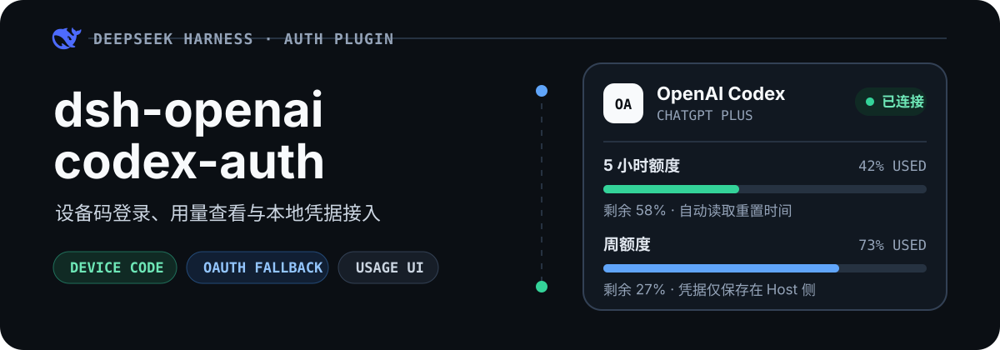
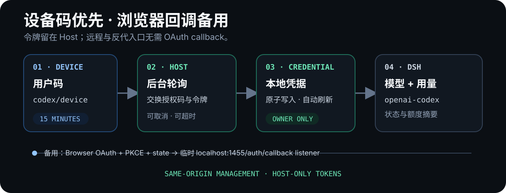

<p align="center">
  
</p>

<p align="center">
  <strong>把 ChatGPT 订阅登录接入 DeepSeek Harness。</strong><br>
  设备码优先、浏览器 OAuth 备用；在 DSH 设置页完成登录、查看 Codex 用量，并自动向 <code>openai-codex</code> 模型提供方提供有效凭据。
</p>

<p align="center">
  <a href="#快速开始">快速开始</a> ·
  <a href="#两种登录方式">登录方式</a> ·
  <a href="#功能一览">功能一览</a> ·
  <a href="#远程与反向代理">远程访问</a> ·
  <a href="#凭据处理边界">安全边界</a>
</p>

## 快速开始

将插件安装到 DSH 的 `web` profile：

```sh
dsh plugin --profile web add @pure01fx/dsh-openai-codex-auth
```

开发 checkout 也可直接使用本地路径：

```sh
dsh plugin --profile web add /absolute/path/to/dsh-openai-codex-auth
```

启动或重启 Web profile：

```sh
dsh web
```

然后：

1. 打开 DSH Web，进入 **设置 → OpenAI Codex**。
2. 点击 **使用设备码登录**。
3. 先复制设置页显示的用户码，再点击按钮打开 OpenAI 验证页并完成登录。
4. 返回 DSH，在 **设置 → 模型提供方** 中选择 `openai-codex`。

设备码登录无需 OAuth callback，适合本机、SSH 隧道和 HTTPS 反向代理场景。

## 两种登录方式

### 设备码登录（推荐）

1. Host 从 OpenAI 申请一次性用户码。
2. 设置页显示用户码、验证网址和 15 分钟倒计时。
3. 用户可以在任意设备打开 <https://auth.openai.com/codex/device> 并输入代码。
4. Host 后台轮询授权结果，交换令牌并写入本地凭据。

设备码 flow 的临时 ID、用户码和轮询状态只存在于内存；DSH Web 重启或用户取消后即失效。

> [!NOTE]
> OpenAI workspace 可能要求管理员允许设备码登录。若申请接口返回 404，设置页会提示改用本机浏览器 OAuth。

### 本机浏览器 OAuth（备用）

OpenAI 的 Codex 公共 client ID 只接受已注册的精确 callback：

```text
http://localhost:1455/auth/callback
```

点击浏览器登录后，设置页会展开诊断卡片，插件同时在 IPv4/IPv6 loopback（`127.0.0.1`/`::1`）的 1455 端口启动临时 callback listener。浏览器会探测自身到 `127.0.0.1:1455` 的连接：成功显示绿色勾选；失败则给出端口转发提示，并提供重新检测和强制继续按钮。外部 OpenAI 页面只会在用户点击按钮后打开。

如果自动 callback 无法抵达，还可以把浏览器地址栏中的完整 callback URL 或 authorization code 粘贴回诊断卡片完成交换。登录完成、取消、失败或 10 分钟超时后 listener 立即关闭；1455 不会在 DSH 启动后常驻监听。

只有通过 HTTP `127.0.0.1` 或 `localhost` 打开 DSH 时，设置页才启用浏览器 OAuth 按钮。反代域名、LAN IP 或 HTTPS 入口应使用设备码。若 DSH 运行在远程服务器，还必须把本机 1455 转发到服务器的 1455。

## 功能一览

| 能力 | 说明 |
| --- | --- |
| 设备码登录 | 无本机 callback，支持远程/headless 使用 |
| 浏览器 OAuth fallback | PKCE + state、端到端 1455 探测、手动 code 回填和临时 callback listener |
| Codex 用量面板 | 展示短周期与周用量、剩余额度和重置时间 |
| 输入框额度圈 | 登录后显示在输入框右下角；Codex turn 结束或点击圆圈时刷新，不做常驻额度轮询 |
| 自动凭据续期 | 在令牌接近过期时刷新，并更新 DSH credentials |
| DSH 模型接入 | 将有效令牌提供给 `openai-codex` 模型提供方 |
| 登录生命周期管理 | 支持取消、15 分钟设备码超时、10 分钟浏览器超时和安全退出 |
| 同源管理路由 | 状态与控制接口挂载到 DSH Web；1456 已移除，1455 仅在浏览器登录期间临时使用 |

## 工作方式

<p align="center">
  
</p>

登录成功后：

1. 凭据以 owner-only 权限原子写入 `$DSH_HOME/openai-codex-auth.json`。
2. access token 通过 DSH credentials 注入 `DSH_OPENAI_CODEX_TOKEN`。
3. `openai-codex` 模型提供方在请求时读取该凭据。
4. 输入框右下角显示 Codex 额度圈；插件在 Codex turn 结束或用户点击圆圈时读取用量，不运行常驻额度轮询。
5. 设置页与额度圈只读取登录状态、账号 ID、过期时间和用量摘要，不接触 token。

## 同源路由

日常状态与控制接口由 DSH Web 提供；只有浏览器 OAuth flow 会额外创建一个短生命周期 callback Server：

| 方法 | 路径 | 用途 |
| --- | --- | --- |
| GET | `/openai-codex/status` | 登录、flow、用量和 CSRF 状态 |
| POST | `/openai-codex/device/start` | 创建或复用设备码 flow |
| POST | `/openai-codex/browser/prepare` | 创建浏览器 flow，返回授权 URL 和一次性 1455 探测 URL |
| POST | `/openai-codex/browser/complete` | 接收用户粘贴的 callback URL 或 authorization code |
| GET | `/openai-codex/browser/start` | 兼容入口：直接启动并跳转浏览器 OAuth |
| POST | `/openai-codex/cancel` | 取消当前登录、关闭临时 listener，保留旧凭据 |
| POST | `/openai-codex/logout` | 取消 flow 并删除本地凭据 |

1456 已完全退役。1455 平时关闭，仅浏览器 OAuth pending 时绑定 loopback；设备码登录完全不使用它。

## 远程与反向代理

### SSH 隧道

设备码登录只需转发 DSH Web 端口，本地端口可以不同：

```sh
ssh -L 8080:127.0.0.1:3080 user@server
```

若还要使用浏览器 OAuth fallback，同时转发 OpenAI 固定的 callback 端口：

```sh
ssh -L 8080:127.0.0.1:3080 -L 1455:127.0.0.1:1455 user@server
```

然后打开 `http://localhost:8080`。设备码登录仍不依赖 1455；只有浏览器 fallback 会临时使用该转发。

### HTTPS 反向代理

DSH Web 继续绑定 `127.0.0.1`。为外部域名配置 DSH trusted host：

```sh
dsh web --trusted-host dsh.example.com
```

反代必须保留浏览器原始 Host，例如 Nginx：

```nginx
location / {
    proxy_pass http://127.0.0.1:3080;
    proxy_set_header Host $http_host;
    proxy_set_header X-Forwarded-Proto $scheme;
}
```

通过反代域名访问时使用设备码登录；浏览器 OAuth 按钮会被禁用。反代还需按 DSH Web 本身的要求转发 WebSocket。

## 配置

插件通常无需额外配置。默认凭据文件为：

```text
$DSH_HOME/openai-codex-auth.json
```

如需改变存储位置，可在 Cordis 配置中设置 `path`：

```yaml
- insert:
    - id: openai-codex-auth
      name: '@pure01fx/dsh-openai-codex-auth'
      config:
        path: /secure/path/openai-codex-auth.json
```

`path` 的优先级高于 `dshHome`。

### 实验性原生 Codex transport

设置 `nativeAdapter: true` 会额外注册 `openai-codex-native`；现有 `openai-codex` 仍由原 provider 管理，不会被接管。原生 route 默认使用 Responses WebSocket v2，在会话首个请求上执行 `generate: false` prewarm，并仅在请求历史严格延伸时发送 `previous_response_id` 与增量后缀。连接重建会清除增量链；安全重试耗尽或握手返回 HTTP 426 后，该 DSH 会话会确定性地回退到 HTTP/SSE。任何 DSH chunk 已输出后都不会跨 transport 重放。

`<base>-fast` 只是公开选择别名：wire model 仍是 `<base>`，请求携带 `service_tier: priority`。若账号目录不声明 priority 能力，或请求前账号 authority 已改变，Fast 会直接失败，不会静默降级。

```yaml
- insert:
    - id: openai-codex-auth
      name: '@pure01fx/dsh-openai-codex-auth'
      config:
        nativeAdapter: true
        nativeWebSocket: true # 默认值；设为 false 可强制实验 route 使用 HTTP/SSE
```


## 凭据处理边界

以下内容说明插件如何处理本地凭据与管理接口，不代表或承诺任何 OpenAI 账号风控结果。

- 浏览器 OAuth 使用 PKCE，并通过随机 `state` 防止 callback 串用。
- 设备码由 Host 轮询；Web 页面只看到用户码、验证网址和过期时间。
- 凭据目录与文件分别以 owner-only 权限创建，并通过文件锁和原子写入更新。
- access token 与 refresh token 只保存在 Host 侧；Web 页面不会读取或保存它们。
- 管理路由复用 DSH `trustedHosts`，并检查 Host、Origin、Fetch Metadata 和 CSRF。
- 临时 callback Server 只绑定 IPv4/IPv6 loopback 的 1455，并只接受注册 URI 对应的 `Host: localhost:1455`、`/auth/callback` 路径和匹配的 state。
- 浏览器连通性探测使用 flow 专属随机 URL，只向 HTTP `127.0.0.1`/`localhost` Origin 返回 CORS 结果；手动 code 提交受同源管理检查和 CSRF 保护，粘贴完整 URL 时还会校验 state。
- cancel 会保留旧凭据；logout 会先停止 flow，再删除凭据，避免迟到写回。
- 若 `DSH_OPENAI_CODEX_TOKEN` 被只读环境来源覆盖，插件会拒绝开始登录并显示明确错误。

## 代理

插件使用 Node.js 原生 `fetch`。若访问 OpenAI 需要 HTTP 代理，启动 DSH 前设置：

```sh
NODE_USE_ENV_PROXY=1 \
HTTP_PROXY=http://127.0.0.1:7890 \
HTTPS_PROXY=http://127.0.0.1:7890 \
dsh web
```

可按环境补充 `NO_PROXY=localhost,127.0.0.1,::1`。

## 常见问题

<details>
<summary><strong>设备码登录提示不可用或返回 404</strong></summary>

当前 OpenAI workspace 可能未启用 device auth。若是组织账号，请联系管理员；也可以通过 HTTP `127.0.0.1`/`localhost` 入口使用浏览器 OAuth fallback。

</details>

<details>
<summary><strong>设备码一直等待或超时</strong></summary>

确认验证页已使用正确账号完成授权，并检查 Host 到 `auth.openai.com` 的网络与代理。设备码 15 分钟后自动失效，可取消后重新申请。

</details>

<details>
<summary><strong>为什么浏览器 OAuth 按钮不可用？</strong></summary>

该 fallback 只支持 HTTP loopback 入口。请用 `http://127.0.0.1:<port>` 或 `http://localhost:<port>` 打开 DSH；反代域名、LAN IP 和 HTTPS 入口请使用设备码。

</details>

<details>
<summary><strong>为什么登录提示 DSH_OPENAI_CODEX_TOKEN 是只读来源？</strong></summary>

环境变量或其他只读 credential source 正在覆盖插件管理的 token。移除该覆盖并重启 DSH 后再登录，避免文件凭据写入成功但模型仍使用旧 token。

</details>

<details>
<summary><strong>账号已连接，但没有显示额度窗口</strong></summary>

点击 **刷新用量** 重试。若 OpenAI 当前未返回可展示的窗口，插件会保留登录状态并显示说明。

</details>

## 本地开发

```sh
pnpm install
pnpm run build
pnpm test
node --check client.js
```

`src/index.ts` 是 Host 实现源；`lib/index.js` 与 `lib/index.d.ts` 由 TypeScript 构建生成。

## License

[MIT](./LICENSE)
